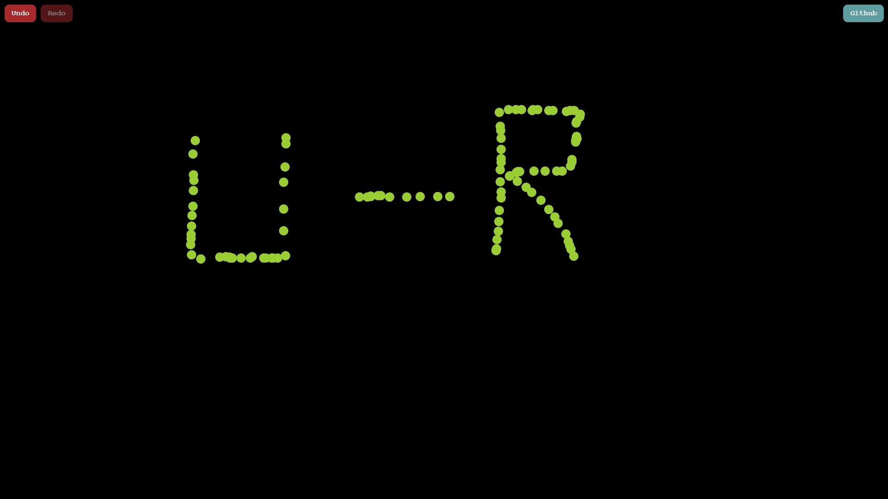

# React Redo/Undo Drawing App 🎯

A lightweight React application that allows users to click anywhere on the screen to create points and use **Undo** and **Redo** functionality to manage them interactively.

---

## ✨ Features

- Click to add points on the screen
- Undo the last added point
- Redo the last undone point
- Clean and responsive UI
- Pure React with useState – no external state libraries

---

## [DEMO URL](https://react-redo-undo.vercel.app/)

## 📸 Demo

  
_Include a screenshot of your app named `demo.jpg` in the root directory._

---

## 🚀 Getting Started

### 1. Clone the repository

```bash
git clone https://github.com/thealiyasar/react-redo-undo.git
cd react-redo-undo
```

### 2. Install dependencies

```bash
npm install
```

### 3. Run the app locally

```bash
npm start
```

Then open [http://localhost:3000](http://localhost:3000) in your browser.

---

## 🧠 Technologies Used

- React
- JavaScript (ES6+)
- CSS

---

## 📁 Project Structure

```
.
├── public/
│   └── index.html
├── src/
│   ├── App.js         # Main app component
│   └── index.js       # Entry point
├── .gitignore
├── package.json
└── README.md
```

---

## 📝 License

This project is open source and available under the [MIT License](LICENSE).

---

## 🤝 Contribution

Feel free to fork the project, submit issues or pull requests.  
Feedback is always welcome!

---

## 💬 Author

Built by [Ali Yaşar](https://github.com/thealiyasar)  
Let’s connect on [LinkedIn](https://www.linkedin.com/in/thealiyasar/)
